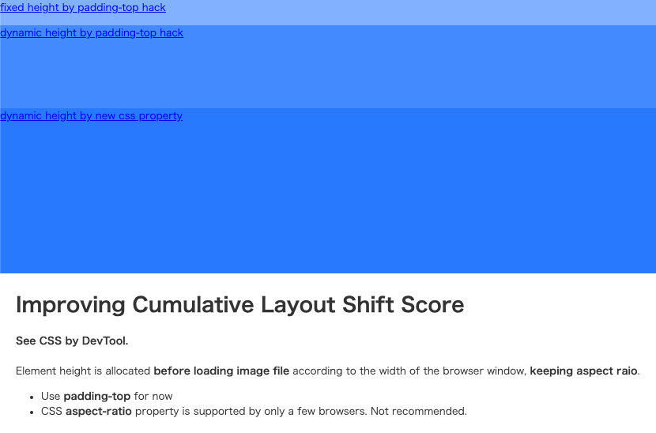

# cls-best-practice
Example html and css to minimize Cumulative Layout Shift.

## Allocating height before loading image
Example: [cls.html](cls.html)

### e.g. 1
Fixed height. By padding-top hack.

### e.g. 2
Dynamic height, keeping aspect ratio. By padding-top hack.

### e.g. 3
Dynamic height, keeping aspect ratio. By CSS aspect-ratio property.
